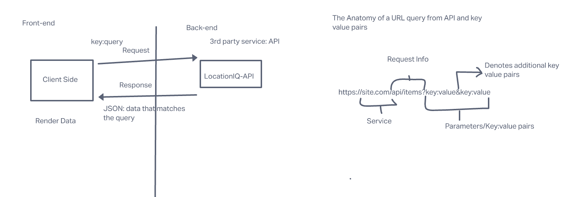
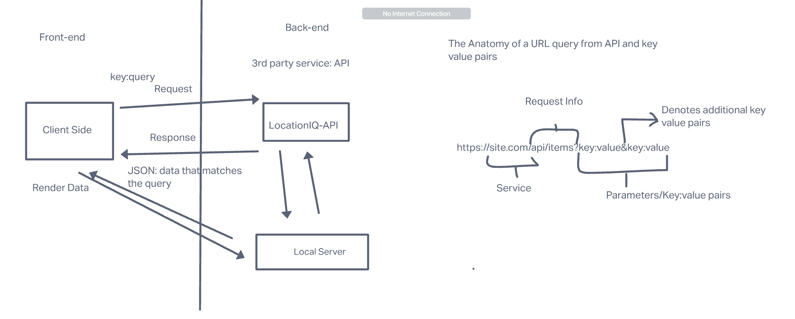

# city-explorer-API

**Author**: Eden and Ella
**Version**: 1.0.0 (increment the patch/fix version number if you make more commits past your first submission)

## Overview
<!-- Provide a high level overview of what this application is and why you are building it, beyond the fact that it's an assignment for this class. (i.e. What's your problem domain?) -->
API is used for handling endpoints for city explorer react app. It parses data on server side and sends it to the front end to fulfill the request. 

## Getting Started
<!-- What are the steps that a user must take in order to build this app on their own machine and get it running? -->
create a repo and git clone it to your local machine, npm install express, dotenv, cors and nodemon, then set up the server.js file. Run nodemon to turn the server on 

## Architecture
<!-- Provide a detailed description of the application design. What technologies (languages, libraries, etc) you're using, and any other relevant design information. -->

;

## Change Log
<!-- Use this area to document the iterative changes made to your application as each feature is successfully implemented. Use time stamps. Here's an example:

01-01-2001 4:59pm - Application now has a fully-functional express server, with a GET route for the location resource. -->
Time Estimates
For each of the lab features, make an estimate of the time it will take you to complete the feature, and record your start and finish times for that feature:

Name of feature: ______________Everything__________________

Estimate of time needed to complete: ___All night__

Start time: __2pm___

Finish time: __9pm___

Actual time needed to complete: __All Night___

## Credit and Collaborations
<!-- Give credit (and a link) to other people or resources that helped you build this application. -->
Tai is a savior. 
Ella is a saint. 